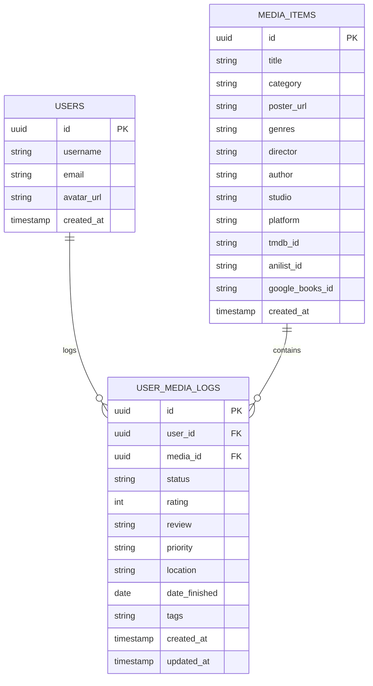
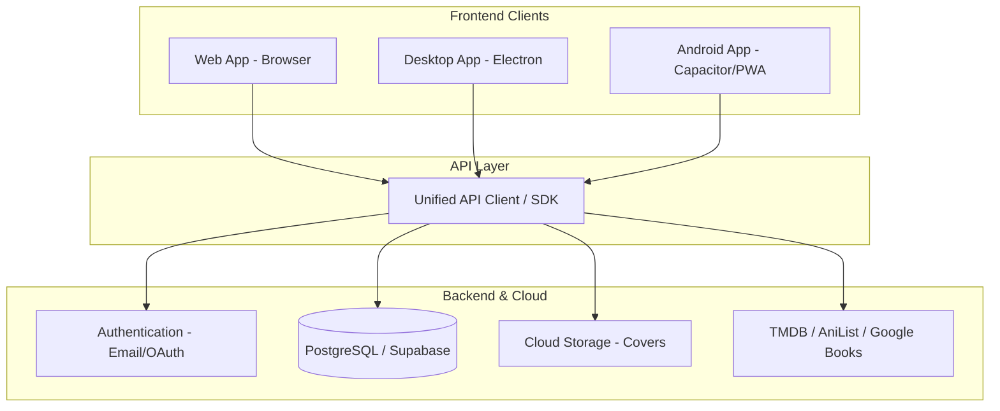

# 🚀 Media Tracker: Multi-User & Multi-Platform Expansion Plan

This document outlines the architectural blueprint, database evolution, platform roadmap, and infrastructure cost breakdown to evolve **Media Tracker** from a single-user offline desktop app into a shared, multi-user system for 10–20 users across **Desktop (Windows/Linux)**, **Web (Browser)**, and **Mobile (Android)**.

---

## 1. Executive Summary & Codebase Reuse

| Metric | Details |
| :--- | :--- |
| **Target Audience** | 10–20 collaborative users / friends sharing reviews & libraries |
| **Code Reuse Rate** | **~85% of existing code** (Zero UI rewrite required) |
| **Reusable Layers** | React 19 UI components, Tailwind CSS v4 design system, filtering/sorting/grouping algorithms, TMDB/AniList/Google Books metadata clients |
| **Core Shift** | Replace local SQLite IPC (`window.electronAPI.invoke`) with a unified API client (e.g. Supabase / REST client) |
| **Estimated Hosting Cost** | **$0.00 / month** (100% covered by free tiers) |

---

## 2. Database Evolution & Schema Design

### 2.1 Current Schema (Single-User Monolith)
Currently, media metadata and user review fields are stored together in one table:
```sql
CREATE TABLE items (
    id INTEGER PRIMARY KEY AUTOINCREMENT,
    title TEXT NOT NULL,
    category TEXT NOT NULL,
    status TEXT NOT NULL,
    rating INTEGER,
    review TEXT,
    date_finished TEXT,
    priority TEXT,
    location TEXT,
    image_path TEXT,
    genre TEXT,
    tags TEXT,
    author TEXT,
    director TEXT,
    studio TEXT,
    platform TEXT,
    created_at TEXT DEFAULT CURRENT_TIMESTAMP
);
```

### 2.2 Multi-User Schema (Relational & Normalized)
To support shared reviews, aggregate community ratings, and friendship activity feeds without duplicating metadata, split the data into 3 core tables:



#### Key Advantages of this Schema:
1. **Shared Media Library**: When 5 friends watch the same movie, the poster and metadata are stored once.
2. **Community Reviews**: View all friends' ratings and reviews on any movie card (e.g., *Group Average: 8.4/10*).
3. **Friend Activity Feed**: Real-time stream of what your friends are currently watching or recently completed.

---

## 3. Platform Architectures



### 3.1 Target 1: Multi-User Desktop App (Windows & Linux)
* **Approach**: Keep Electron, but replace `electron/database.cts` with direct cloud queries via the unified API client.
* **Packaging**: `electron-builder` builds native Windows `.exe` installers and Linux `.deb`/`AppImage` binaries.

### 3.2 Target 2: Web Application (Online-Only, Desktop & Mobile Browsers)
* **Approach**: The current Vite + React frontend builds directly to static HTML/JS/CSS.
* **Hosting**: Deploy on **Vercel**, **Cloudflare Pages**, or **Netlify** with continuous Git deployments.

### 3.3 Target 3: Android Mobile Application
* **Recommended Approach (Capacitor)**:
  - Add `@capacitor/core` and `@capacitor/android` to the project.
  - Generates a native Android Studio project and builds standalone `.apk` packages without rewriting React code.
* **Alternative Approach (PWA)**:
  - Add a Web App Manifest (`manifest.json`) and service worker.
  - Allows 1-click home screen installation directly from mobile Chrome.

---

## 4. Backend & Hosting Comparison

| Feature | **Supabase (Recommended)** | **PocketBase** | **Custom Node/Express** |
| :--- | :--- | :--- | :--- |
| **Underlying DB** | Managed PostgreSQL | SQLite (Single binary) | Any (Postgres/MySQL) |
| **Authentication** | Built-in (Email, Google, etc.) | Built-in (Email, OAuth2) | Manual (JWT/Sessions) |
| **Realtime Sync** | Built-in (Websockets) | Built-in (SSE) | Manual (Socket.io) |
| **File Storage** | 1 GB Free (S3-compatible) | Local / S3 | Local / S3 |
| **Maintenance** | Zero maintenance (Cloud) | Needs a small host | Needs VPS maintenance |

---

## 5. Cost Breakdown (10–20 Users)

For a private group of 10–20 active users:
* **Database Records**: ~2,000–10,000 records (~5 MB)
* **Bandwidth**: < 5 GB / month

| Service | Provider & Tier | Monthly Cost |
| :--- | :--- | :--- |
| **Database & Auth** | Supabase Free Tier (500 MB DB, 50k MAU) | **$0.00** |
| **Web Hosting** | Cloudflare Pages / Vercel (Unlimited bandwidth) | **$0.00** |
| **Media Images** | Direct CDN Links (TMDB/AniList) + 1 GB Supabase Storage | **$0.00** |
| **Android APK Distribution** | Direct APK download / GitHub Releases / PWA | **$0.00** |
| **Total Monthly Cost** | | **$0.00 / mo** |

---

## 6. Implementation Roadmap

### Phase 1: Backend Setup
1. Create a Supabase project and apply the relational schema (`users`, `media_items`, `user_media_logs`).
2. Set up Row Level Security (RLS) policies so users can read public reviews and edit their own logs.

### Phase 2: API Client Abstraction
1. Create `src/services/apiClient.ts` to encapsulate all CRUD operations (`getLibrary()`, `addLog()`, `updateLog()`, `getFeed()`).
2. Update React components to use `apiClient` instead of `window.electronAPI.invoke`.

### Phase 3: Auth & Social UI
1. Add a Login / Sign-up view.
2. Add a **"Friends / Activity Feed"** tab to view what other users are watching/reading and their reviews.

### Phase 4: Web & Mobile Packaging
1. Deploy Web App to Vercel / Cloudflare Pages.
2. Initialize Capacitor (`npx cap add android`) and export the Android `.apk`.
3. Package the updated multi-user Windows/Linux Electron executable (`npm run make`).
